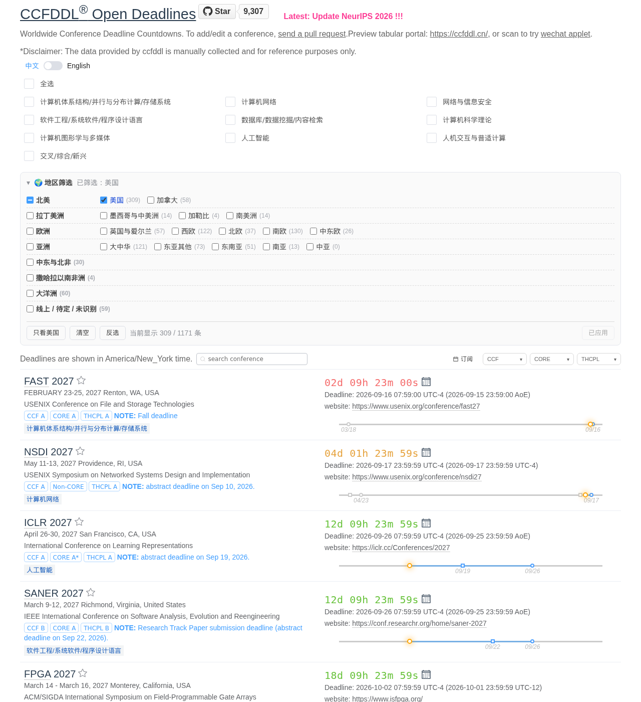
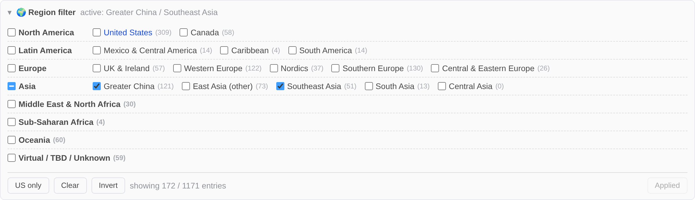

# CCF Deadlines 地区筛选 / Region Filter

一个给 [ccfddl.com](https://ccfddl.com/)（[ccfddl/ccf-deadlines](https://github.com/ccfddl/ccf-deadlines)）用的 Tampermonkey 脚本：
在原有的 CCF 分类 / 等级筛选之外，再加一层**按举办地筛选**。

原站可以按 CCF 分类和 A/B/C 等级筛，但没法回答「只看在美国开的会」或者「只看亚太的会」。这个脚本补上这一块。

*A Tampermonkey userscript that adds venue-based filtering to ccfddl.com — a dedicated **US** toggle plus continents and finer sub-regions. Scroll down for English.*



## 能做什么

- **只看美国**：一个独立开关，或者用底部的「只看美国」一键切换。
- **按地区**：8 个大区，其中 4 个再细分，一共 19 个可勾选的桶：

  | 大区 | 细分 |
  | --- | --- |
  | 北美 | 美国、加拿大 |
  | 拉丁美洲 | 墨西哥与中美洲、加勒比、南美洲 |
  | 欧洲 | 英国与爱尔兰、西欧、北欧、南欧、中东欧 |
  | 亚洲 | 大中华、东亚其他、东南亚、南亚、中亚 |
  | 中东与北非 | — |
  | 撒哈拉以南非洲 | — |
  | 大洋洲 | — |
  | 线上 / 待定 / 未识别 | — |

  「大中华」含中国大陆、香港、澳门、台湾；点大区的复选框会一次勾上它下面所有细分。
- 每个桶后面标了**当前数据里的条目数**，勾选时底部实时显示「将显示 N / M 条」。
- 跟着站点的 中文 / English 开关自动切换语言；选择保存在 localStorage，刷新和下次打开都还在。
- 不动原站的任何筛选，跟 CCF 分类、等级、搜索框、收藏叠加使用。



## 安装

1. 装 [Tampermonkey](https://www.tampermonkey.net/)（Violentmonkey 也行）。
2. **Chrome / Edge 用户请先做这一步**：打开 `chrome://extensions`，找到 Tampermonkey → 详细信息 →
   打开 **「允许用户脚本 / Allow user scripts」**（Chrome 138 以下是开启右上角的「开发者模式」）。
   不开的话油猴拿不到页面上下文，脚本会跑但筛选不生效，详见下面的[排查](#排查)。
3. 点这里安装：**[ccfddl-region-filter.user.js](https://raw.githubusercontent.com/owenfucell/ccfddl-region-filter/main/ccfddl-region-filter.user.js)**
4. 打开 <https://ccfddl.com/>，筛选面板就在 CCF 分类那一排的下面。

勾选之后点「应用（刷新）」。**需要刷新是设计如此**，原因见下。

## 排查

**面板出来了，但底下显示「⚠ 脚本被限制在扩展沙箱里」，会议一条没少。**

这是最常见的情况，几乎都出在 Chrome/Edge 上。筛选靠替换 `window.fetch`，只有脚本跑在**页面自己的
JS 上下文**里才有用。Chrome MV3 下油猴需要 `chrome.userScripts` 权限才能把 `@grant none` 的脚本放进
页面上下文；这个权限要用户手动开，没开的时候油猴会退到扩展的隔离世界——DOM 是共用的，所以面板照样画得出来，
但那里的 `window.fetch` 和页面用的根本不是同一个对象，patch 了也没用。

修法：`chrome://extensions` → Tampermonkey → 详细信息 → 打开「允许用户脚本 / Allow user scripts」
（Chrome 138 以下开「开发者模式」），然后刷新页面。参考
[Tampermonkey FAQ Q209](https://www.tampermonkey.net/faq.php?locale=en&q=Q209) 和
[Tampermonkey#2607](https://github.com/Tampermonkey/tampermonkey/issues/2607)。

在隔离世界里脚本会自己尝试往页面插一个 `<script>` 爬回页面上下文；Chrome 会用扩展自身的 CSP 把这种内联
注入挡掉，所以那条路在 Chrome 上走不通——脚本会明确把上面这段提示打在面板和控制台里，而不是装作筛过了。
`test/extension_test.py` 就是专门守着这个行为的回归测试。

**面板显示「⚠ 未拦截到会议数据请求」。**

这是另一回事：脚本进到页面上下文了，但没看到 `allconf.yml` 的请求，多半是上游改了数据加载方式。
欢迎提 issue。

## 原理

ccfddl.com 现在是一个 Rust/Leptos 编译成 WASM 的前端，每页只渲染 10 条，所以在 DOM 里直接隐藏行会把分页和计数全打乱（筛完可能一页只剩两三条，页码却还是原来那么多页）。

这个脚本改成在**数据进入 WASM 之前**下手：在 `document-start` 时替换 `window.fetch`，拦下 `/conference/allconf.yml`，按 `place` 字段逐个年份条目过滤，再把过滤后的 YAML 交给应用。于是原站自己的分类筛选、分页、计数、排序全都自动是对的——它根本不知道有东西被拿掉了。

代价就是改筛选要刷新一次页面（数据只在启动时拉一次）。所以面板用的是「改动 → 点应用」而不是即时生效。

一个会议如果某一年在美国、另一年在欧洲，两条会分别归到各自的地区，而不是整个会议二选一。

### 地点是怎么判断的

`place` 字段是人工填的，格式很杂：`Denver`、`Boston, MA, USA`、`Vancouver BC Canada`、`Taiwan， China`（全角逗号）、`Antalya, Türkiye`、`Málaga, Spain (hybrid)`、`Virtual`。判断分四步，都在 [`regions.data.json`](regions.data.json) 里可配：

1. 归一化：转小写、去掉变音符号（`Türkiye` → `turkiye`）、全角逗号转半角、去掉句点（`U.S.A.` → `usa`）。
2. 在全串里按词匹配 224 条**国家/地区别名**（含 `United Kindom`、`Greec` 这类原始数据里的拼写错误）。
3. 没命中的话，看有没有整段是**两字母代码**（`Long Beach, CA` → 美国，`Antwerp, BE` → 西欧）。
4. 还没命中的话，查 390 条**城市 / 州省名**（`Denver`、`Montreal`、`Leuven`、`Madrid`）。

另外只要出现 `virtual` / `online` / `TBD` 就额外打上「线上」标签——所以 `Toronto, Canada & Virtual` 同时属于加拿大和线上。实在认不出来的进「未识别」桶，不会被悄悄丢掉，还会在浏览器控制台打出来。

在完整的 1171 条会议年份数据上，1170 条能归类；唯一漏网的是 `Co-located withUSENIX Security '21`，它本来就没写地点。

## 开发

```bash
./build.sh                      # regions.head.js + regions.data.json + regions.body.js -> .user.js
python3 validate.py             # 把分类表跑一遍真实数据，列出分布和未识别项
python3 test/run_tests.py       # 用 QuickJS 加 DOM 垫片真跑一遍脚本（30 项检查）
```

改地区表就改 [`regions.data.json`](regions.data.json)，然后 `./build.sh`。**不要直接改 `ccfddl-region-filter.user.js`**，它是生成的。

两个测试默认用 `test/fixture.yml`（从真实数据里挑的 71 个会议，覆盖各种奇怪写法）。想跑全量：

```bash
curl -O https://ccfddl.com/conference/allconf.yml
python3 validate.py && python3 test/run_tests.py
```

`test/run_tests.py` 会在 QuickJS 里加载真正的 `.user.js`，把过滤结果和 `validate.py` 里的独立实现逐字节比对，并驱动面板的勾选、全选、应用等交互。

还有一个可选的真机测试，直接打 ccfddl.com 线上站：

```bash
pip install playwright && python3 -m playwright install chromium
python3 test/browser_test.py
```

它按 Tampermonkey 的方式注入脚本，确认 WASM 应用确实只渲染了筛选后的会议。

```bash
python3 test/extension_test.py
```

这个把脚本当成真正的 Chrome 扩展内容脚本加载，主世界和隔离世界各跑一遍：主世界必须完整筛选，
隔离世界必须给出可照做的提示而不是静默失效。

## 兼容性说明

脚本靠替换 `window.fetch` 工作。如果上游改了数据加载方式或者 `allconf.yml` 的结构，筛选会**失效但不会破坏页面**——面板会显示「⚠ 未拦截到会议数据请求，筛选可能未生效」，站点照常使用。遇到这种情况欢迎提 issue。

---

## English

The site lets you filter by CCF category and rank, but not by where the conference actually happens. This script adds that: a dedicated **US** toggle, eight continental groups, and 19 selectable buckets in total — including Greater China, East Asia (other), Southeast Asia, South Asia, Central Asia, and MENA as separate buckets.

**Install:** [Tampermonkey](https://www.tampermonkey.net/), then [ccfddl-region-filter.user.js](https://raw.githubusercontent.com/owenfucell/ccfddl-region-filter/main/ccfddl-region-filter.user.js). The panel appears under the CCF category checkboxes on <https://ccfddl.com/>.

**Chrome/Edge users:** enable **"Allow user scripts"** for Tampermonkey in `chrome://extensions`
(or developer mode below Chrome 138) *before* installing. Without it Chrome MV3 cannot give the
script the page's JavaScript context, so `window.fetch` cannot be replaced: the panel appears but
nothing is filtered. The panel says so explicitly when this happens.

**How it works:** ccfddl.com is a Rust/Leptos WASM app that renders 10 rows per page, so hiding rows in the DOM would wreck pagination and counts. Instead the script replaces `window.fetch` at `document-start`, intercepts `/conference/allconf.yml`, drops the conference-year entries whose `place` does not match, and hands the filtered YAML to the app — so the site's own filtering, sorting, pagination and counts all stay correct. The trade-off is that changing the selection needs one page reload, which is why the panel has an explicit Apply button.

Each conference-year is classified independently, so a conference held in the US one year and in Europe the next appears under both.

**Classification** normalises the free-text `place` field (diacritics, full-width commas, periods), then matches 224 country aliases, then two-letter segments such as `CA` / `BE`, then 390 city and state names. Anything mentioning virtual/online/TBD also gets the "Virtual" tag. 1170 of the 1171 real entries classify; the one that does not has no venue in the data at all.

**Development:** edit [`regions.data.json`](regions.data.json), run `./build.sh`, then `python3 validate.py` and `python3 test/run_tests.py` (the latter runs the real userscript under QuickJS with a DOM shim and diffs its output against an independent reference implementation). `test/browser_test.py` additionally verifies against the live site with Playwright.

## License

MIT — see [LICENSE](LICENSE). Not affiliated with the ccfddl project; it just reads the data their site already publishes.
